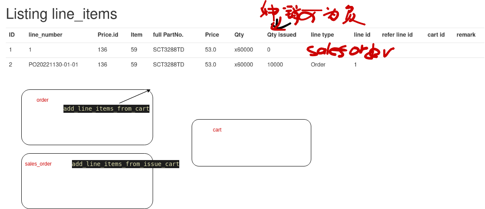

# Cute ERP
A cute online ERP, with order system, simple CRM, documents system; 
Cute: easy to use, hide complex for user; robust, modulate;
use ruby on rails inspired by webERP.

CuteERP: Focus on my needs first， new market development & lean startup in mind sales.

## Build
1. install ruby on rails(rvm)
1. update & install gems
   - bundle update
   - bundle install
1. install nodejs(or rubyracer)   
1. install postgreSQL(and create user rorcuteerp, rorcuteerp)
1. initialize database: rake db:setup
1. rails server -e development
1. login cuteerp with user name and password in : db/seeds.rb

## deploy
1. heroku

## Features
### product management
1. products: part_number, type, family, name, description, package, MPQ
1. support assembled products: 
   - assembled item is basic item, but with base, extra, assembled information
1. product status(index: -1, 0, 1, 2)
   - 0: unqualified, 1: inactive, 2: active, -1: EOLed      
1. wiki,related marketing report

### customer management
1. customer
   - overview 
     - basic info: contacts & orders & opportunities & wiki
   - credit:(-1, 0, 1, >1)
     - 0: unqualified, 1: inactive, >1: credit, -1: closed  
   - sales_type: OEM, ODM, internal, re_sell  
1. multiple currencies(now RMB and USD) support   
1. different ship_to and bill_to address support(clone by default)
1. export / import customers list
1. contacts:
   - status:(-1, 0, 1)
     - 0: unqulified; 1: inactive; 2: active; -1: archieved/invalid 
   - link contact as bill_to and ship_to easily 

### order system
set_price(PriceList)->price(Quotation), order(PO), sales_order(production_order, invoice, packing_list)

#### prices
- set_price: (part_number /quantity /price / dist_customer / released_at(key))
   - latest price list view(like price list excel, with extra price)
      - step values/names set in current_user.settings
      - setting: name: order_quantity_OEM1, value: 1000, note: released_date
   - support assembled set_price: final price and extra price  
- prices(customer prices)
   - price is the key block for orders, linked to item and customer.
   - support assembled price
     - final price=base + extra through item(part_number=base_item+extra_item) 
   - protections: 
     - avoid to create similar price(same customer, item, volume(condition))   
     - can't edit approved price
     - warning price > set_price 
   - price request & approval(active) & archive
     - auto fillin related set_price according to sales_channel(ODM/OEM) & order_quantity
     - Price reduce request need approval
     - when approved, price status set approved, and inactive old price
     - status(approved/outdated -1: 0, 1, 2, 3, 4)
     - 0: unqulified; 1: requested; 2: approved; ->3: active(inactive to approved)  -1: outdated/archieved 
   - price import/export    
- quotation(united)
   - each price can print a quotation
   - united quotation has many customer prices (with order_quantity(codition) & remarks)
   - quotation remarks(can modify freely)
   - quotation number  

#### Orders(customer order, sales order)
- customer order ==issue to==> sales orders(scheduled) 分解订单 ==> shipped
1. customer order(single driving force)
   - types/catalogs: order, preorder(?), reversed_order
   - orders status(line_items): issued, shipped(?) 
   - issue to sales order(means: sales_orders are issued PO)
   - original order upload(pdf format)     
1. sales order(issued from customer order, related to shipment)
   - customer order ==issue to==> sales orders(scheduled) 分解订单
   - sales orders =>start production =>confirm/ship to=> shipped
   - edit sales orders(shipped: confirmed=shipped=invoiced)
     - how to edit-issued: edit quantity, zero delete lineitems? issue more? 
     - split sales orders: new sales order
   - Sales orders shipped
   - invoice, packing_list   
   - overview report
   - ship confirmation
   - ship status input
   - invoiced/shipped orders can't edit, use reverse order to handle      
1. preorders(only forecast, not act as real order data?)
   - used for forecast. easy to edit and reschedule, act like sales orders(shipment).
   - be cleaned every month
   - can turn to real customer orders, if match?
   - order_kind: preorders
1. delivery
   - re-schedule: delivery_plan date change freely.
   - auto highlight outdated so when delivery_plan < Time.now.
   - fixed date: when delivery, set delivery_plan = delivery_date, then fixed.    
1. import/export orders/sales orders?    

### Admin: overview of active Orders
1. Sales Rolling Forecast view is *Main View*(admin)
   - All customer orders(with preorders) together in a year forecast overview
     - sort by shipped, open-orders, and preorders. with dispatch schedule
     - Customers orders view, sort by:
       - sales type: ODM, OEM, internal, Re-sell
       - product group: Digital_baseband, RF, PA, Vocoder, 
       - territoreis: KR, ExFJ, FJ
       - customers
       - part_numbers
       - prices
     - Products view, sort by:
       - sales type
       - product group
       - product family(SCT3258, SCT3604, SCT3600)
   - as easy as excel, or better
     - fill the table with forecast-preorders
     - change preorder quantity

1. Product Rolling Forecast view in *Main View*(admin)
   - Catalog the actually selling products
   - Calalog settings

### payment & receivable(under development)
1. payment
1. receivable account
1. balance

### business opportunities management
- BO means customer projects
1. index(show opportunities in catalog)

### activities(tasks) management
1. related to customer.
1. related to opportunities

### user management
1. administrator interface(Overview based on user role)
1. sales overview
   - Sales Rolling Forecast
   - Customer open orders

### documents system(markdown, like wiki)
1. customers wiki
1. products wiki
1. marketing wiki

### settings
1. configuration
   - documents system, 
   - payment term: COD, T.T in advance
   - set_price: order quantities
   - company information: name, address,  
   - opportunities can hide
   gem for setting models
   https://github.com/ledermann/rails-settings

### maintaince(import, export)
- Easily import and export all major data timely
- import (Beginning data) / export(backup data monthly?)
  - customers list
  - items list
  - users list
  
  - set_prices list
  - prices list
  - customer_orders list  
  - sales_orders list

 - 年度期初数据（含上年度open orders) 

- uniq identities for import / exprot
   - Customer: customer engilish short name: Onreal
   - Item: part_number: SCT3258TD, TN, TDM
   - SetPrice: release_date
   - Price: price_order_number QO2022102205
   - Order: order_number PO2022102206
   - SalesOrder: order_number SO2022102206

## development
### upgrade rails from 3.2 to 4.2 tips
1. [upgrade guide](https://edgeguides.rubyonrails.org/upgrading_ruby_on_rails.html)
1. [upgrade tips](https://ruby-china.org/topics/22280?locale=en)
1. Change logs:
   - Gemfile update to 4.xx
   - whitelist_attribute
   - mass_assignment_san...
   - group assets

### feature introduces

### bugs and feature request
#### Feature request
see issues, focus on core features
1. customer orders(single driving force)
   - types: shipped orders(confirmed), open orders, preorders 
   - customer-orders: issued: scheduled;  confirm sales orders also make orders shipped?   
   - preorders: easy to edit, reschedule; based on shipment used for forecast 
1. sales orders(based on shipment) 
   - types: shipped orders(invoice, confirmed), scheduled shipments, forecast shipments
   - issue from sales orders, open orders and pre-orders.   
- more
   1. rolloing forecast: includes 3 shipped orders, open orders, preorders with dispatch schedule  
   - (list view) re-schedule easily: 
   - add new line(in current view), delete line, change quantity 
   - auto clear forecast orders, when issue sales orders (first in, first out)?
   - manually adjustment forecast quantity & auto re-schedule outdated forecast schedule(in forecast view) 

   - filter by: product number/ product family / product type/ Territory / customer/
   - default:  product type/ territory /       
   - Year view of booking 
   - remain booking, allocate orders 

line_type: Order, -> issued SalesOrder(scheduled -> shipped); 
quantity_issued:

### bugs and small Feature points
1. items

1. customers
  - sales type: customer or distributor 
  - show/ add new contact can't save

1. Orders(customer order)
   - forbidden edit issued orders failed when the line not be issued
   - sales order should merge same items line like order does
   - order can't edit; shows private not_issued?  
   - should restore line_items' cart_id or clear cart_id after save(or will leave failed line_items)
   - validate line_items: presence not work
   - add report of orders and sales_orders for (1month, 3month,6month,1year)
   - show warning when create order without monthly exchange rate(stamp:EX201606)

1. Opportunities
   - status mark default uses last status
   - todo status using auto; with label color
   - Opportunities: priority force to integer
   - project type: default should be DT

1. price as quotation or a flexible quotation?
   - quotation has many prices; prices has many quotations.
   - g scaffold quotation quotation_number:string remark:string price_id:integer
   - [ ] show by catalogs: active(current stared price, requested price), all(approved, requested) 
   - finance confirmed price: mark 1640  
   - [ ] bug: choose set_price will reset customer name
   - [ ] bug: use simple quotation view as price request view.(include price request?)    
   - [ ] bug: customer full name: blank but not nil?

1. documents(posts)
   - assign correct subject in customer wiki, product wiki creation
   - default wiki templates for customer wiki, products wiki, markets wiki
   - product wiki: auto create short url according to products name policy.
   - Add website for customers in templates
   - Docs, fetch 1st line as post title
   - Docs, add edit preview in the same page.
   - markets model? name, catalog(based on solution), market catalog label

1. users
   - only admin can add new user, and update the profile
   - user can reset the password  
   - admin can active , inactive user
   - user rights policy

1. admin
   - sales orders overview, sort with item index
   - overview filter for choosen customer  

- Can't mass-assign protected attributes for SalesOrder: {:delivery_status=>"reschedule"}

orders/show: Can not edit this order, order been issued!
- 应该醒目提示已分解订单（右上角显示订单状态？），隐藏编辑按钮
- 取消人民币和美元兑换，number_to_currency

- 全部使用中文，根据客户语言选择订单

### status
- customer status(credit): active, inactive, archieved, no_quotation?
- item status(index): active,<=> inactive, archived 
- price status(status): requested, approved => active, archieved
  - customer/show: 
    - show valid prices: approved but not archieved;
    - or show working prices: actived
- contacts

### set_price
refine:
- set price list
  - sort by product family?
  - import/export verification：part_number should be unique

### more
delete reverse order also should issue_back

SCT3258PV for Korea, not assemble?
sales_type: set_price/ ODM/OEM, internal, resell? 如何拆分

#### 生成生产订单
sales_orders: start_production, uniform_number(use lineitem.full_name first )
生成六联单（sales_order:start_production，production_number，line_items:product_property)
如何拆分生产订单？直接修改SO？

预计交期: 2024-09-02 ↻ 现在发货

#### 生产发货首页 role

